# Hermes Incident Workflow

Hermes Incident Workflow is a local-first reference implementation for bounded AI-assisted incident remediation. Hermes may investigate and propose code, while a deterministic controller owns scope, attempts, deadlines, patch policy, verification, delivery eligibility, artifacts, and cleanup.

This is an experimental POC. The default workflow uses synthetic incidents, fixture repositories, disposable containers, and file-based delivery mocks. It does not connect to production systems.

## Why this exists

An AI coding agent should not decide that its own change is safe. This project demonstrates a stricter pattern:

```mermaid
flowchart LR
    A["Untrusted incident and bounded evidence"] --> B["Trusted controller"]
    B --> C["Fresh Hermes attempt"]
    C --> D["Network-disabled writable sandbox"]
    D --> E["Host-derived patch"]
    E --> F["Path and content policy"]
    F --> G["Repository and controller-owned tests"]
    G --> H["Optional disposable services"]
    H --> I["Clean-workspace reapply and digest check"]
    I --> J["Draft delivery artifacts"]
    J --> K["Cleanup and auditable closeout"]
    G -->|"Failed"| B
```



The central rule is simple: **Hermes proposes; the controller decides.**

## Included

- Deterministic success, retry-success, exhaustion, timeout, and prompt-injection rejection scenarios.
- A real Hermes candidate-provider adapter with a fresh session per attempt.
- An isolated Hermes profile with no web, browser, memory, delegation, MCP, or persistent container access.
- Read-only inputs, one dedicated writable output, a read-only container root, and Docker network mode `none` for editing tools.
- Host-generated patches with size, path, symlink, binary, mode-change, and restricted-content checks.
- Repository and controller-owned tests run in a pinned, network-disabled, read-only Docker sandbox; clean-workspace patch reapplication remains controller-owned.
- Hash-linked run artifacts and file-based draft GitHub and notification mocks.
- An optional synthetic event-indexing example using PostgreSQL, Kafka, and OpenSearch.

## Requirements

- Python 3.11 or newer
- Git
- Docker for candidate-code tests, with Compose for optional service checks. Bootstrap the digest-pinned Python image before verification because sandbox execution uses `--pull=never`.
- [Hermes Agent](https://github.com/NousResearch/hermes-agent) v0.19.1 only for
  the sandbox smoke test or a real-model run. Local qualification used
  [revision `26e0b1c`](https://github.com/NousResearch/hermes-agent/commit/26e0b1c12c2bbc2d1ef4640df18abff2d737445a);
  another build reporting the same version is not yet qualified.

The deterministic fixture workflow does not require model credentials or a model request.

## Quick start

From the repository root:

```bash
./scripts/bootstrap-pinned-images.sh sandbox
./scripts/run-local.sh preflight
./scripts/run-local.sh test

./scripts/run-local.sh run \
  --scenario retry-success \
  --budget-seconds 120 \
  --max-attempts 2

./scripts/run-local.sh verify --latest
```

The `retry-success` fixture deliberately fails the first candidate, returns bounded controller feedback, accepts the second candidate, recreates the exact candidate in a clean workspace, writes draft delivery mocks, and cleans up.

## Disposable service example

The larger example models an event identity collision across two tenants:

```bash
./scripts/bootstrap-pinned-images.sh all
./scripts/run-local.sh preflight --with-docker

./scripts/run-local.sh run \
  --scenario event-indexing-collision \
  --budget-seconds 900 \
  --max-attempts 2 \
  --with-docker

./scripts/run-local.sh verify --latest
```

The accepted candidate must pass repository tests, a controller-owned verifier, real message flow through Kafka, a read-only evidence check in PostgreSQL, tenant-scoped document behavior in OpenSearch, exact digest recreation, and cleanup.

The service images need roughly 3 GB of Docker memory. They expose no host port and communicate only on an internal Compose network.

## Install the isolated Hermes profile

Review `hermes-profile/config.yaml`, then install the distribution:

```bash
./scripts/bootstrap-pinned-images.sh sandbox
./scripts/install-hermes-profile.sh
python3 scripts/hermes_sandbox_smoke.py
```

The smoke test uses a local scripted model endpoint and makes no paid inference request. It proves that the real Hermes CLI loads the supplied skill and routes terminal work through the locked-down Docker backend.

## Use a real Hermes model

Configure provider authentication through Hermes outside this repository. Do not place provider credentials in project files or exported environment variables.

Then opt in explicitly:

```bash
./scripts/run-local.sh preflight --with-docker --require-hermes

./scripts/run-local.sh run \
  --scenario retry-success \
  --candidate-provider hermes \
  --hermes-profile hermes-incident-workflow \
  --hermes-provider provider-id \
  --hermes-model model-id \
  --budget-seconds 600 \
  --max-attempts 2
```

The host Hermes process may contact the selected inference provider. Terminal tools remain in the network-disabled Docker sandbox, and the controller does not forward ambient provider keys to that container. Review your provider's data-processing and retention terms before sending any non-synthetic input.

## Trust model

| Surface | Authority |
|---|---|
| Workflow policy | Reviewed local `config/workflow.json` |
| Incident and evidence | Untrusted bounded data |
| Hermes proposal | Untrusted until the host derives and validates the patch |
| Attempts and deadline | Deterministic controller |
| Acceptance | Repository tests, controller verifier, optional service check, and clean reapply |
| Delivery | Local draft artifacts only |
| Cleanup | Controller-owned and recorded |

Incident content cannot select the repository, allowed path prefixes, test command, attempt ceiling, or delivery operation. Those controls come from the trusted workflow policy.

## Artifacts

Each run writes an ignored `artifacts/<run-id>/` directory containing the control state, event stream, redacted evidence, candidate contracts, exact patches, test results, independent verification, mock delivery payloads, and closeout record.

Artifacts are local audit evidence, not immutable attestations. Do not commit them; they may contain model output and local paths.

## Extend the workflow

Start with [Adapting the workflow](docs/adapting-the-workflow.md). Preserve the control boundary when adding another fixture, language, verifier, or brokered connector.

Live observability, database, source-control, notification, and cloud connectors are intentionally absent. Automatic merge, approval, deployment, production writes, and incident mutation are out of scope.

## Documentation

- [Architecture](docs/architecture.md)
- [Threat model](docs/threat-model.md)
- [Adapting the workflow](docs/adapting-the-workflow.md)
- [Verification status](docs/verification.md)
- [Container security baseline](docs/security-baseline.md)
- [Release checklist](docs/release-checklist.md)
- [Security policy](SECURITY.md)
- [Third-party notices](THIRD_PARTY_NOTICES.md)

## Relationship to Hermes Agent

This is an independent integration project and is not an official Nous Research project. Hermes Agent is installed separately and is not vendored here. See its upstream repository and license for its own terms.

## License

Apache-2.0. See [LICENSE](LICENSE).
