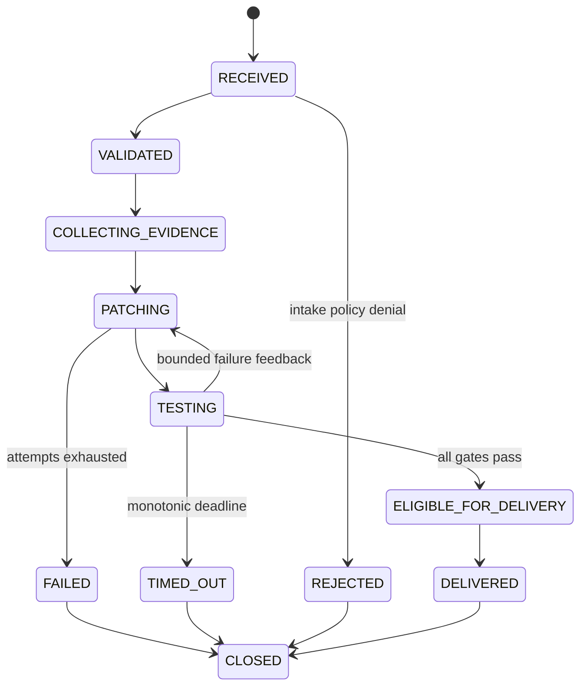

# Architecture

## Design objective

The workflow lets an AI agent prepare a candidate without granting it control over policy, acceptance, delivery, or live systems.

## Trust domains

1. **Trusted policy:** repository identity, service and environment allowlists, path prefixes, test command, evidence limits, Hermes profile, attempt ceiling, and total deadline.
2. **Untrusted task data:** incident text, evidence, prior diagnosis, failed-test output, repository content, and model proposal.
3. **Deterministic evidence:** host-derived patch, hashes, test output, service results, clean-reapply result, delivery mocks, and cleanup record.

`config/workflow.json` is trusted operator input. Incident files cannot raise its limits or replace its test and path policy. The controller rejects unknown policy fields, unsafe prefixes, malformed command arrays, and values above compiled ceilings.

## Execution stages

### 1. Intake

The controller validates the incident schema, repository ID, service, environment, and evidence window. Known instruction-injection phrases are rejected before evidence collection.

### 2. Evidence

The fixture broker returns a bounded set of logs and rows. Sensitive fields and known markers are redacted before they cross the candidate-provider boundary.

A production adaptation should replace this fixture with narrow brokers, not raw Grafana, database, or cloud credentials.

### 3. Candidate attempt

The fixture provider applies reviewed patches for deterministic tests. The Hermes provider creates a fresh session, mounts the request and baseline read-only, and gives terminal tools one writable output directory.

The Hermes process runs on the host because inference requires network access. Its terminal tools run inside Docker with network disabled. Provider credentials remain in Hermes authentication state and are not forwarded into the terminal container.

### 4. Patch policy

The host computes the patch from an external Git baseline. It rejects path escape, forbidden path prefixes, irregular files, links, cache files, binary patches, unsupported mode changes, excessive file count, excessive bytes, workflow edits, and selected restricted-content markers.

The model's proposal is reporting data. It is never the authoritative patch or acceptance result.

### 5. Verification

The controller runs repository tests and an optional verifier stored outside the editable repository in a pinned Python 3.12 Alpine container. Both gates use a read-only root, read-only candidate and verifier mounts, no network, a non-root user, an exact environment allowlist, a private tmpfs, dropped capabilities, no-new-privileges, and bounded CPU, memory, and process counts. A controller-private CID file and unique ownership label scope forced cleanup if the Docker client times out. The optional service example mounts the candidate read-only and exercises disposable PostgreSQL, Kafka, and OpenSearch services.

After acceptance, a separate verifier reapplies the retained patch to a clean baseline and requires the same candidate digest and tests.

### 6. Delivery and closeout

Successful runs write a draft pull-request payload and notification payload to local JSON files. The interface exposes no merge, approval, deployment, or incident-state operation.

Cleanup runs for success, rejection, failure, and timeout. Compose resources and scoped Hermes containers are removed before the run is closed.

## Attempt state

## Extension points

- `CandidateProvider`: produce a candidate without accepting it.
- Scenario repository and patch fixtures: model application behavior.
- Controller verifier: keep hidden acceptance logic outside the candidate workspace.
- Compose verifier: exercise application-specific disposable services.
- Evidence broker: return normalized, bounded, redacted evidence.
- Delivery sink: accept only an already verified digest and expose draft-only operations.

Each extension must preserve the same authority boundary and artifact linkage.
